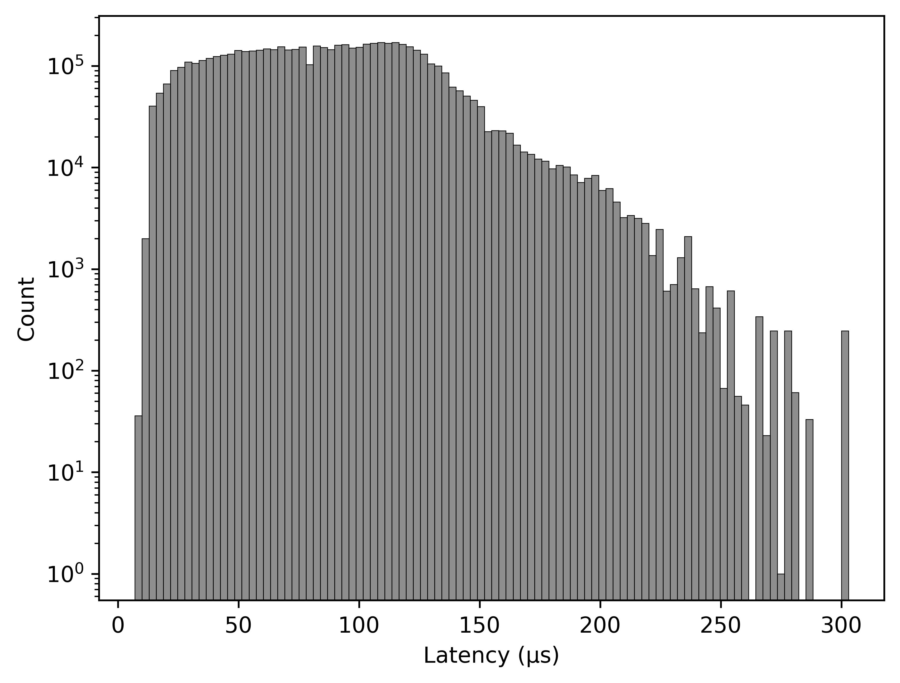
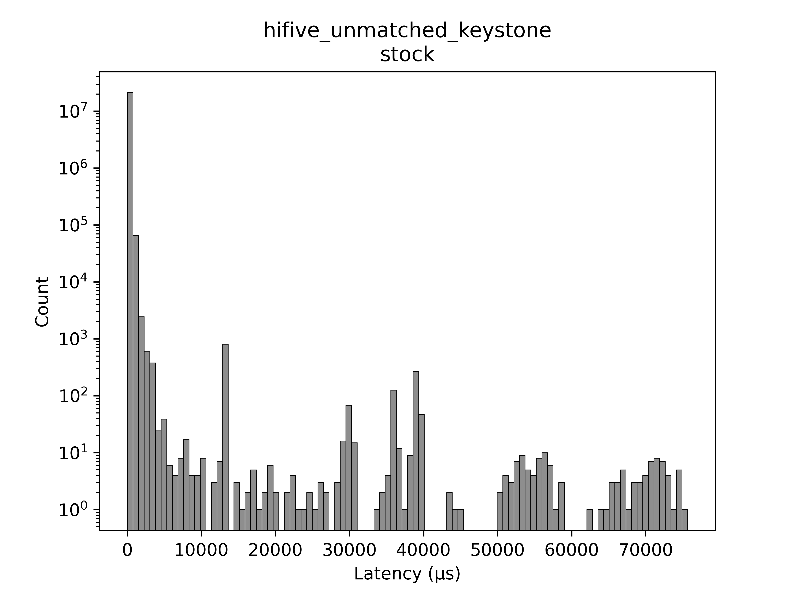
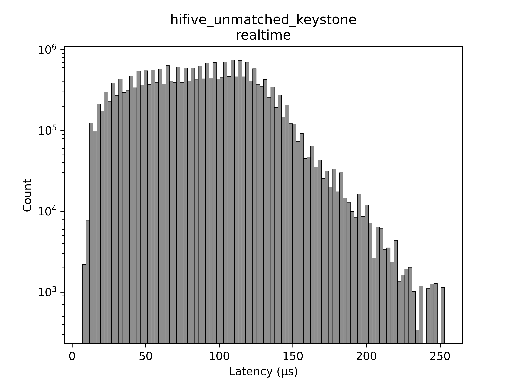

# Results

## Beagle V Fire

Stock       | Realtime
:----------:|:-------------:
|

## HiFive unmatched (6.6.78)

Stock       | Realtime
:----------:|:-------------:
|

## HiFive unmatched keystone (6.6.87)

Stock       | Realtime
:----------:|:-------------:
|

## Raspberry pi 5 (original build method)

Stock       | Realtime
:----------:|:-------------:
|

## Raspberry pi 5

Stock       | Realtime
:----------:|:-------------:
|

## QEMU RISCV

Stock       | Realtime
:----------:|:-------------:
|

